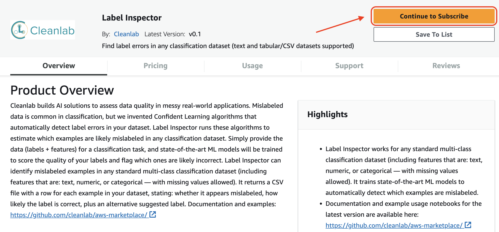

# General Guide for using AWS Marketplace

## Obtain the product ARN from a Marketplace listing

First, you need to subscribe to the AWS Marketplace product. Open the listing page for the product that you want to use
(eg. for our **Label Inspector** solution, the listing page is [here](https://aws.amazon.com/marketplace/pp/prodview-rlbhc2lxttdio)).

On the listing, click on the **Continue to subscribe** button located at the top right.



That will lead you to the **Subscribe to this software** page, where you can review the EULA and pricing terms and then click on **"Accept Offer"**. 


After accepting the offer, you will be able to click on the **Continue to configuration button** located on the top right of the page.


Clicking on that button will lead you to the **Configue and launch** page. Here, you can select a **region**, and you will see a **Product Arn** corresponding to the selected region. This is the product ARN that you'll later need to specify to use the product.

**Copy that ARN** so you have it later when it's needed in your code. 


## Run sample notebooks from AWS SageMaker

It is easier to run a sample notebook on AWS SageMaker instead of from your own computer. To do this, first create a new notebook instance following [this guide](https://docs.aws.amazon.com/sagemaker/latest/dg/howitworks-create-ws.html).

After you are in either Jupyter or JupyterLab from within Sagemaker, upload the sample notebook and corresponding data files to your instance. Data files required for the sample notebook must be located in the `data/` folder within the same directory as the sample notebook (e.g. the data files for the [Label Inspector](label-inspector/label_inspector.ipynb) sample are located in [label-inspector/data/](label-inspector/data/)).

After uploading the sample notebook and data files, you should be able to execute the entire sample notebook directly from AWS SageMaker.


## Run sample notebooks locally from your computer

To run a sample notebook locally, there are a few variables that have to be setup:

### SageMaker Execution Role

You will need to specify a IAM role that has **AmazonSageMakerFullAccess** to be able to fully execute the sample notebooks locally. 

You can either specify an existing IAM role that has this permission (you can find if any existing roles fit this specification by opening the [IAM console](https://console.aws.amazon.com/iam/) and selecting **Roles** to see existing roles), or follow [this guide](https://docs.aws.amazon.com/sagemaker/latest/dg/sagemaker-roles.html#sagemaker-roles-create-execution-role) to create an new execution role with the required permissions.

The SageMaker Execution Role ARN will likely be in the format of: `arn:aws:iam::XXXXXX:role/service-role/SageMaker-XXXXX` 

### Configure AWS Credentials (skip if you have already have your AWS CLI configured)

Install the [AWS CLI](https://docs.aws.amazon.com/cli/v1/userguide/cli-chap-welcome.html) using the following command:

```console
$ pip install awscli
```

Then, configure your AWS credentials and default region by executing the following and entering the corresponding information:

```console
$ aws configure

AWS Access Key ID [None]: <Enter Access Key ID>
AWS Secret Access Key [None]: <Enter Secret Access Key>
Default region name [None]: <Enter region name>
Default output format [None]: <Enter output format>
```

For more information about configuring AWS, refer [here](https://docs.aws.amazon.com/cli/latest/userguide/cli-configure-quickstart.html).

Alternatively, if you do not wish you setup AWS CLI, you can enter your AWS Access Key ID, Secret Access Key and region directly in each sample notebook directly when prompted.

